:title: Fedora Badges
:skip-help: true
:css: style.css

Fedora Badges: Federated badges for freedom.
============================================

.. image:: badges_fan.png
    :height: 164px

David Gay
---------

-   https://github.com/oddshocks
-   https://twitter.com/oddshocks
-   http://oddshocks.com
-   ``2048R/7B478256 2013-04-20``

Ralph Bean
----------

-   https://github.com/ralphbean
-   https://twitter.com/ralphbean
-   http://threebean.org
-   ``2048R/971095FF 2012-12-06``

You can find us in ``#rit-foss`` on ``irc.freenode.net``.

.. image:: http://i.creativecommons.org/l/by-sa/3.0/88x31.png

----

**David Gay**

-   Humanitarian free software hacker.

-   RIT Lab for Technological Literacy, or "the FOSSBox".

-   Red Hat intern on the Fedora Infrastructure Team.

**Ralph Bean**

-   Red Hat senior software engineer on the Fedora Infrastructure Team.

-   RIT alumni.

-   All-around lover of pizza.

----

Fedora Badges isn't gamification, it's a recognition system.

It recognizes participation and contributions to Fedora by awarding
**virtual badges**.

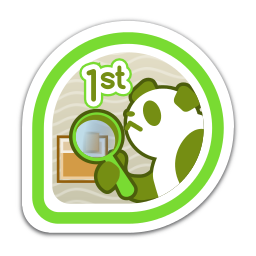

----

We want Fedora contributors to earn badges.

Award topics include:

-   FAS membership and group membership (like sponsors).

-   Ask Fedora activity, Tagger activity, and Fedora Wiki edits.

-   IRC meetings and Fedora Planet posts.

-   Bodhi updates (testing and stable), tests, and karma.

-   Koji builds and commits to Fedora package repositories.

-   Community-awarded badges.

-   Event attendance... like Flock 2013. :)

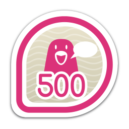

----

**Mozilla Open Badges** was launched in September 2011 to issue digital badges
to recognize skills and achievements.

The **Open Badges Infrastructure (OBI)** defines a badge as a JSON blob
containing some metadata at a particular URL. The JSON can also be baked-in to
the PNG.

A badge is:

-   a **title**.

-   a **description**.

-   an **image**.

-   a link to badge **criteria**.

----

Badges are awarded by creating an **assertion**.

Assertions associate a badge with an email address.

Assertions are JSON blobs which live at cryptic web addresses.
The validity of a badge award can be checked by confirming that
an appropriate JSON blob lives at the URL for that assertion.

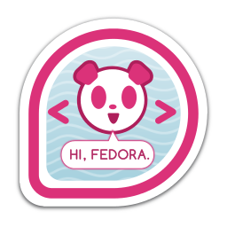

----

Anyone can issue Open Badges.

Already awarding badges:

-   NASA

-   Disney-Pixar

-   4H

-   DigitalMe

-   TotaraLMS

-   Moodle

Mozilla claims that PBS, P2PU, Intel, and the US Department of Education
are soon to follow.

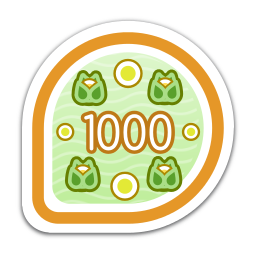

----

Badges from all sources can be exported to your **Mozilla Backpack**
at http://beta.openbadges.org and displayed all over the web.

Backpacks are decentralized. Fedora Badges is technically a backpack.
Badges can be exported between any backpack. Mozilla's service is
simply the original one. It provides a clean interface and
useful widgets for displaying your badges on a website.

----

The Stack
=========

Fedora Badges makes use of 5 core pieces of Fedora infrastructure software.

GitHub organization: https://github.com/fedora-infra/

#. Fedmsg: The FEDerated MeSsaGe Bus

#. Datanommer

#. Fedbadges

#. Tahrir-API

#. Tahrir

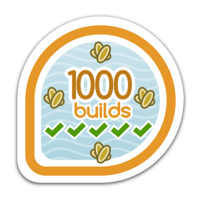

----

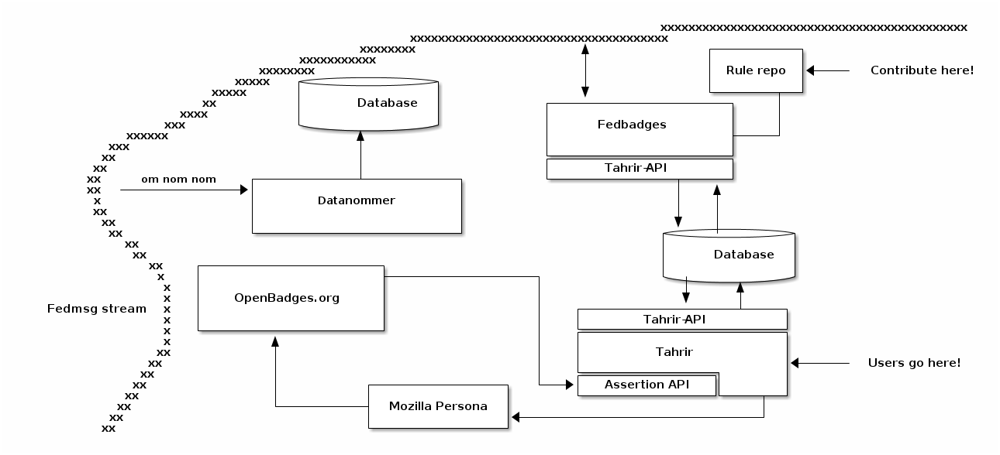

----

**Fedmsg** is Ralph's message bus for hooking together activity in all areas of
Fedora-land.

Fedmsg emits a message whenever something happens on a Fedora
service.

http://www.fedmsg.com

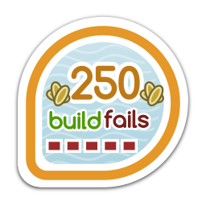

----

**Datanommer** consumes messages from Fedmsg and stores them
in a database.

Every time Fedmsg emits a message that may result in someone
earning a badge, Fedora Badges checks Datanommer to see
if they have met the criteria for the badge.

https://github.com/fedora-infra/datanommer

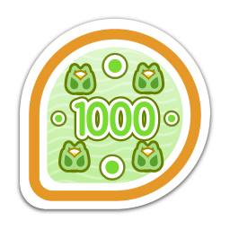

----

**Fedbadges** hooks Tahrir, Tahrir-API, and Tahrir-REST into fedmsg.

Fedbadges also contains badge criteria in the form of YAML files located in our
git repo:

http://infrastructure.fedoraproject.org/infra/badges/rules/

These YAML files define the badges in the system and say what triggers the
badge award.

https://github.com/fedora-infra/fedbadges

----

**Tahrir-API** provides the database model for Fedora Badges, as well as a
high-level ``TahrirDatabase`` class for easily interacting with the database.

It makes use of the **SQLAlchemy** object-relational mapper.

https://github.com/fedora-infra/tahrir-api

----

**Tahrir** is the web application where people can go to view their badges,
explore Fedora Badges, and see how they compare to other Fedora contributors.

It is a **Pyramid** web application powered by **Python** and **righteous
freedom**.

Development of Tahrir and Tahrir-API was the focus of my internship this
summer.

https://github.com/fedora-infra/tahrir

----

----

All of these tools are **system-agnostic**, which means that they can be used
outside of Fedora, too.

Anyone can deploy their own Tahrir!

The OpenID provider is entirely configurable.

In the future, we hope to make the authentication system fully pluggable and
make the web application's theming easily customizable.

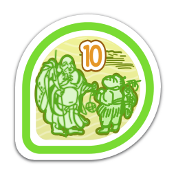

----

We don't want to keep badges to contributors.

In the future, **regular Fedora users** will be able to earn badges during
their use of the operating system.

**Desktop notifications** can tell you when you've earned a badge, and clicking
them can take you to the Badges web interface.

Users will be able to offer their own **community badges** to others, like the
"You made <user>'s day!" badge.

.. image:: badge_images/you-can-call-me-patches-05.png

----

Of course, we've only created a small portion of the badges that we hope
will exist by this time next year.

Still unanswered is the question of how **new badges** will be added to the
system.  Possibilities include:

-   Using a pull request system and a git repo.

    -   This is probably more technical than we want.

-   A web form that submits to a "badge committee".

    -   This is probably more closed than we want.

-   A review system similar to our package reviews and Bodhi karma system.

    -   This is -- in our opinion -- the most attractive option.

A fedorahosted tracker has been set up for this purpose at
https://fedorahosted.org/fedora-badges.

----

Acknowledgements
================

-   Ralph Bean and Remy DeCausemaker, mentors and friends

-   Tom 'spot' Callaway, manager

-   Máirín Duffy and Jenn Kotler, pixel ninjas

-   The rest of the Fedora infrastructure team

-   All of Fedora's contributors

-   My fellow FOSSBoxers

-   Richard Stallman for freedom, Linus Torvalds for Linux and Git,
    Bram Moolenaar for Vim, Nicholas Marriott for Tmux,
    Jarkko Oikarinen for IRC, Chris McDonough for Pyramid,
    Mike Bayer for SQLAlchemy, Lennart Regebro for Hovercraft,
    Mozilla for the OBI, and many more

-   Science

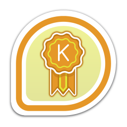

----

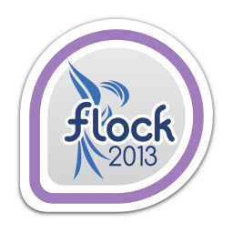

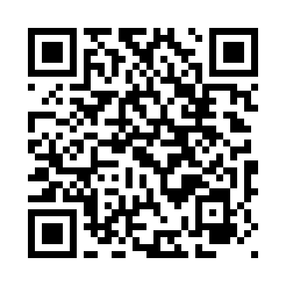
